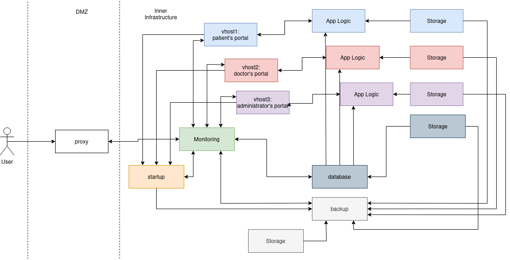

# Hospital infrastracture using Docker compose
Project for the Basics of Virtualization course in Vilnius University (Kaunas Faculty).
The project uses **compose plugin for docker**.

## Containers
The application has seven containers:
1. three containers host three different web services;
2. one container hosts the caddy proxy/load balancer;
3. one container is for data backup;
4. one container hosts the database;
5. one container is runs automatic updates using ansible.

### vhost1: patient portal
Vhost1 hosts the web portal accessed by the patients. It allows them to register to the system, authenticate using their credentials and book appointments in the hosptial.

### vhost2: doctor portal
Vhost2 hosts the web portal accessed by the doctors. In order to access its pages an authentication is needed (the authentication is managed by caddy). Once authenticated, it is possible to list the visits for each doctor and to insert the diagnosis for a new visit.

### vhost3: administration portal
Vhost3 hosts the web portal accessed by the administration of the hospital. In order to access its pages an authentication is needed (the authentication is managed by caddy). It allows to modify the patients' reservations and to modify data in the database providing a friendly GUI.

### proxy
The proxy container hosts a caddy load balancer that disables the direct connection to the containers that host web pages and provides authentication when required.

### backup
The backup container runs a bash script for backing up data automatically everytime the container is started up.

### database
The database container hosts a mysql server. The database creation script are provided in 'compose/database/scripts/'.

### startup
The startup container uses ansible to run a playbook that manages the automatic update of the containers.

## Infrastructure
The application infrastructure is defined in the file 'compose/compose.yml'. 
